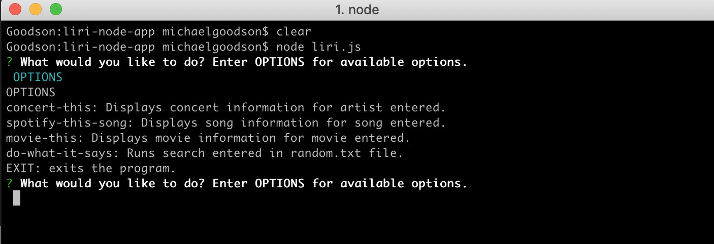

# LIRI

## Overview
LIRI is a command-line Node app for the UO code bootcamp which takes user input and queries various APIs to display results.

### Usage

Start the app with `node liri.js`

Entering `OPTIONS` displays all options.

