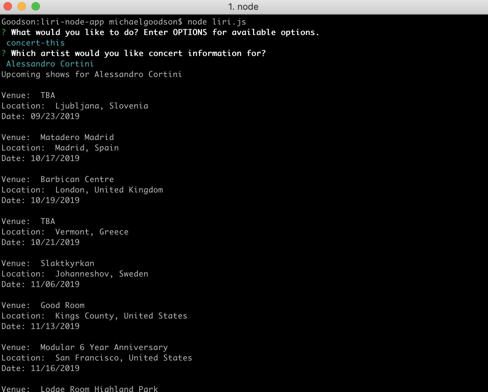
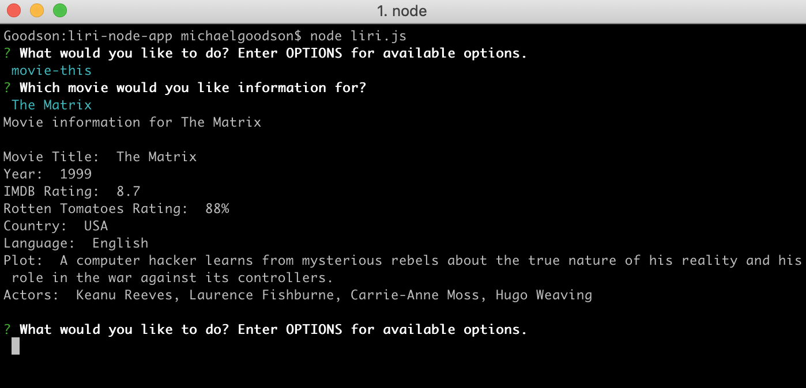
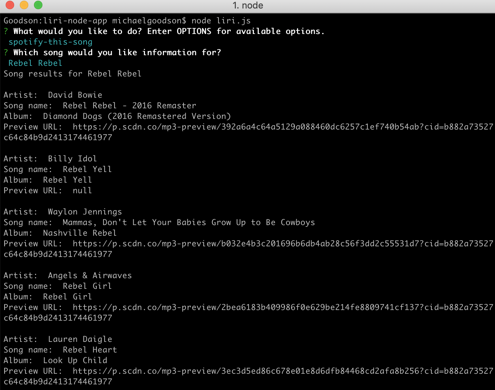
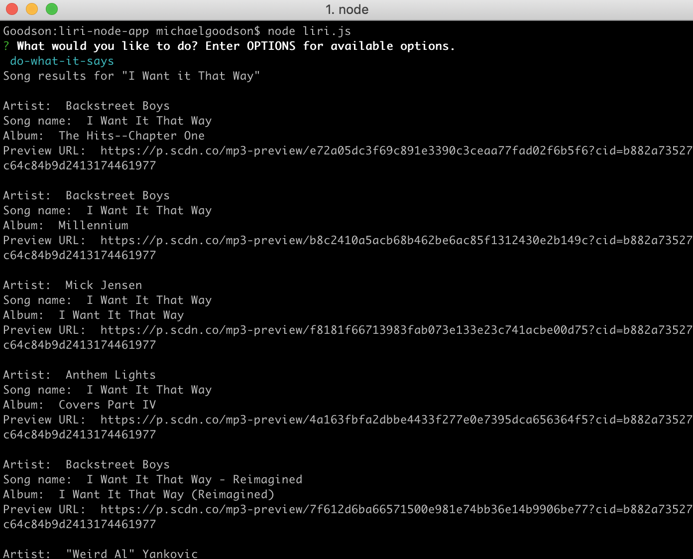

# LIRI

## Overview
LIRI is a command-line Node app for the UO code bootcamp which takes user input and queries various APIs to display results.

### Usage

Start the app with `node liri.js`

Entering `OPTIONS` displays all options.

Entering `concert-this` prompts for which artist you would like concert information for, and displays the results.

Entering `movie-this` prompts for which movie you would like information for, and displays the results.

Entering `spotify-this-song` prompts for which song title you would like information for, and displays the results.

Entering `do-what-it-says` runs the search and query parameter entered in the random.txt file, and displays the results.

Entering `EXIT` exits the program.
